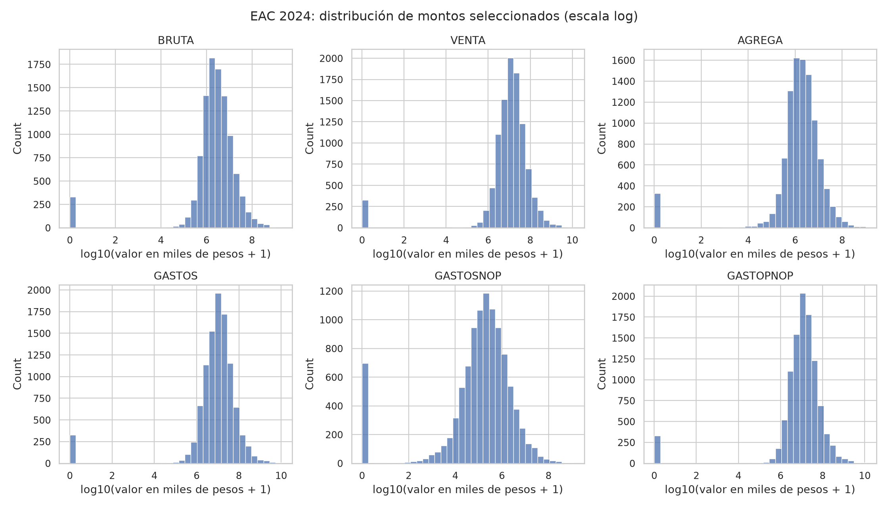
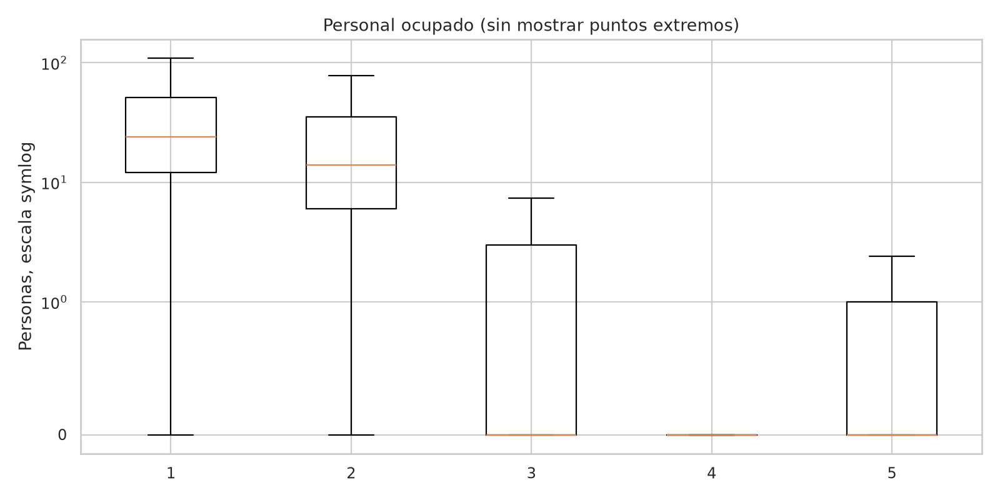
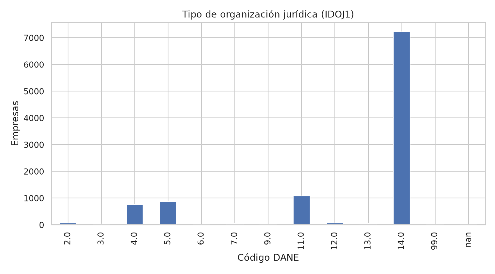
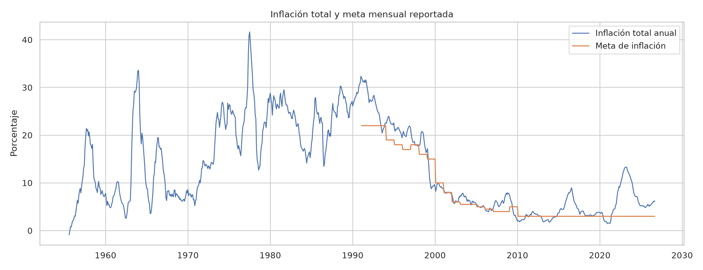
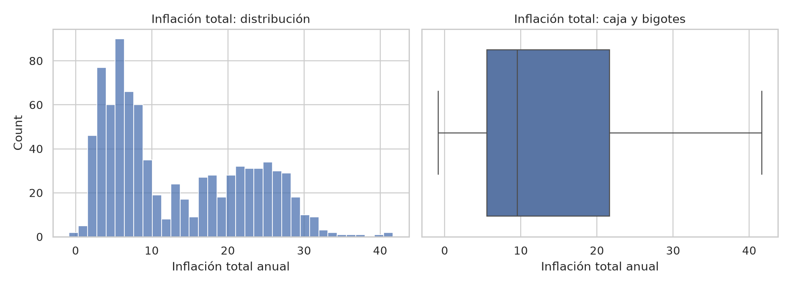
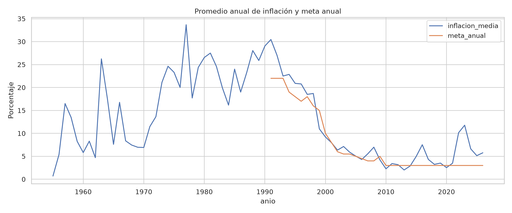
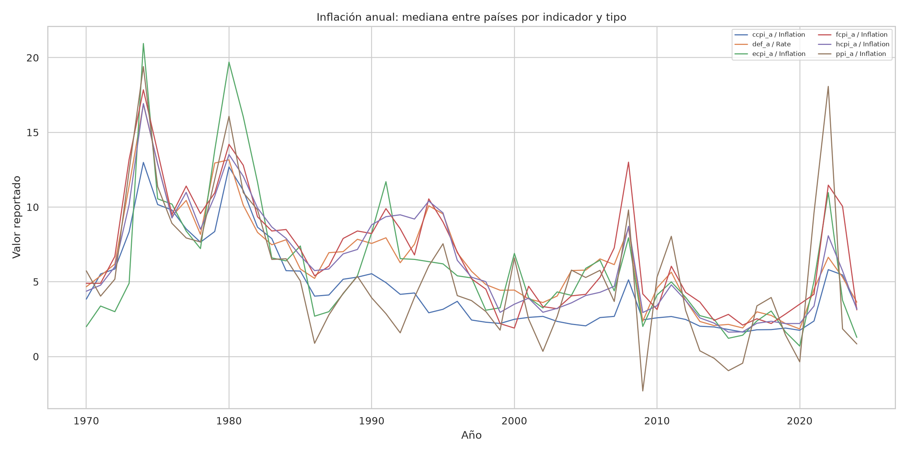
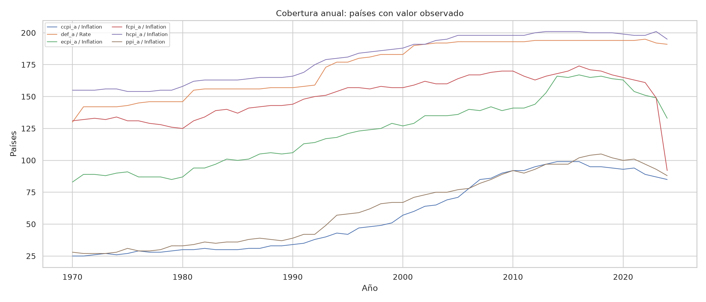
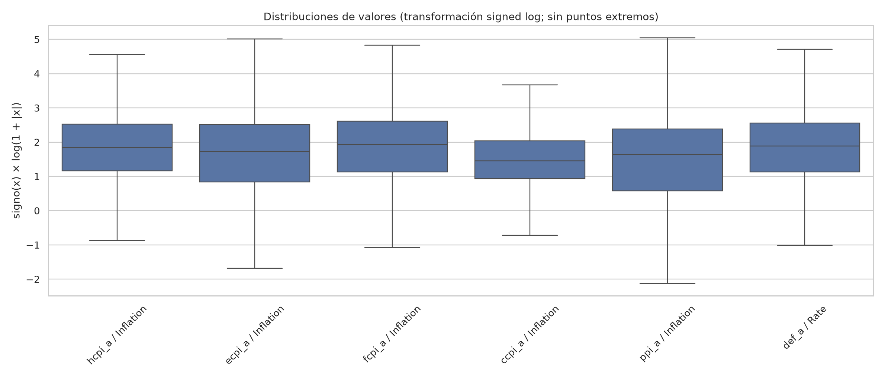

_Última ejecución publicada (UTC): 2026-10-06 03:54_

Las cifras siguientes son resúmenes de la ejecución más reciente. Los candidatos IQR son señales para revisión, no errores confirmados.

- **EAC 2024:** 10,238 registros; 2 faltantes reportados; 73,196 eventos candidatos IQR agregados por variable.
- **Inflación y meta:** 854 valores observados de inflación; meta faltante en 426 observaciones (49.88%).
- **Inflación global:** 53,845 observaciones anuales posibles entre grupos; 12,838 valores faltantes (23.84%); 3,197 candidatos IQR por serie temporal.

Las tablas agregadas descargables están en las subcarpetas de `resultados/`. Los reportes de filas individuales se generan localmente durante el flujo y no se publican.

### EAC

### Inflación y meta

### Inflación global

#### Tablas de resultados

- **EAC:** [eac/](eac/)
- **Inflación y meta:** [inflacion_y_meta/](inflacion_y_meta/)
- **Inflación global:** [inflacion_global/](inflacion_global/)
